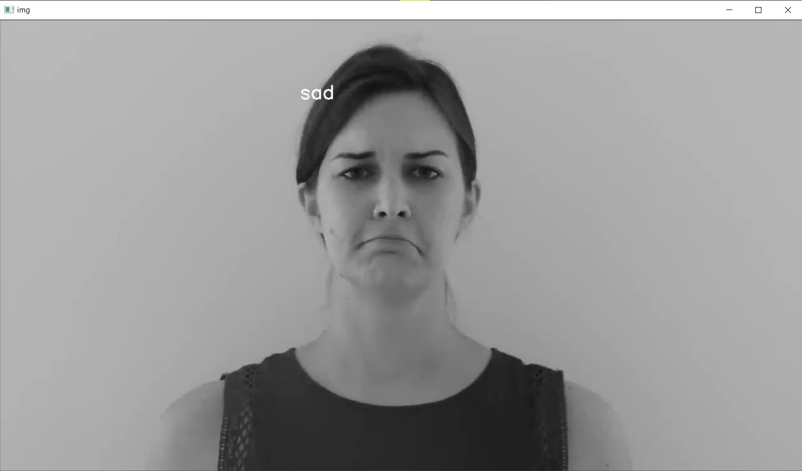
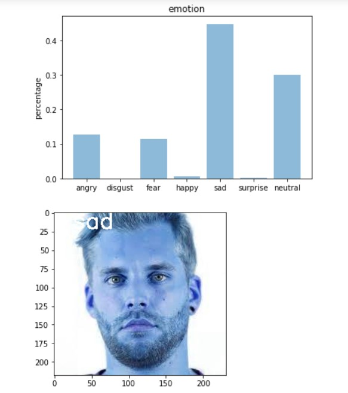

# Facial Expression Detection
A project on creating a system to detect the facial emotion expressed by a human.
This system can run on video streamable platforms.
A new CNN was trained without using transfer learning for building of model.
In this project we can see the effects of 2 different optimizers during the training of the model.
This repository also contains a code for the UI to implement the model.

## System Architecture:

 

## Model Summary:

 

## Output:

### From YouTube Videos:

 
 

### For Picutres:

 

### Note:
The haarcascade_frontalface_default.xml file is required to run the modle as that file is used by the model to identify the face.
# Authors 
Vishnu S S, Aniruddh T S
